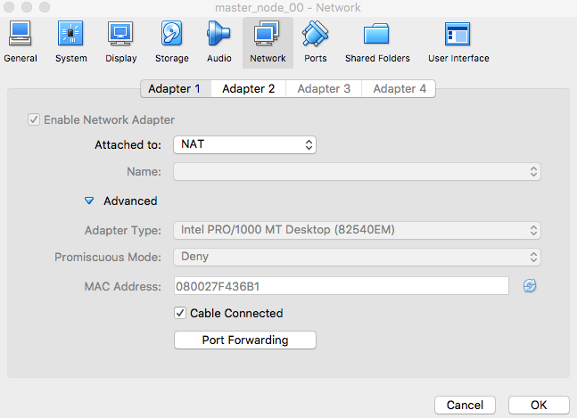
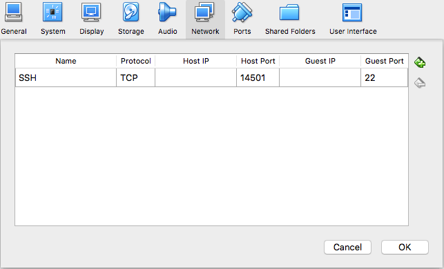
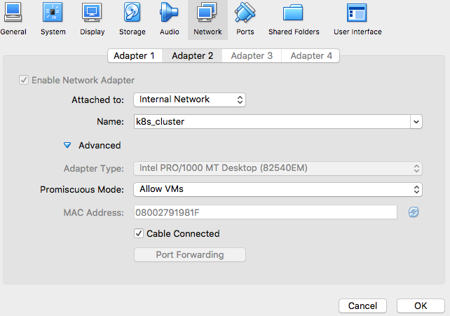

# Multi-Node k8s Cluster
## Usage

First, clone this project `thisproject`:
The prerequisite is to have virtualbox and vagrant on your system.

1. master
2. node-01
3. node-02
4. node-03

These VMs are all connected via an internal network named k8s-cluster on the second network interface eth1. The command to create the internal is shown below.
In fact each VM contains two Network Interfaces:
1. O&M: NAT and setup for SSH (to acces each node)
<p align="center">
  
</p>
Clicking on the "Port Forwarding" button will show you the following seting for the master node:
<p align="center">
  
</p>

2. Internal Network to reach all the nodes

<p align="center">
  
</p>

```sh
$ git clone https://github.com/davidgarciaMontreal/k8s_cluster_setup.git
$ cd k8s_cluster_setup/vagrant
$ vagrant up

```
Once the cluster is up you can access them with using the vagrant cli (note: you must under the directory k8s_cluster_setup/vagrant)
```sh
$ vagrant ssh master
```
or node-01 ...

To join the cluster use the join command located in the master node  ~/current_config.log
```sh
$ vagrant ssh node-01
```
#Generate A Bearer Token for the Web UI
Once logged in to the master node, generate the following token: 
```bash
kubectl -n kube-system describe secret $(kubectl -n kube-system get secret | grep admin-user | awk '{print $1}')
```
#URL on your local env
Once you have generated the token on the master one, login with your browser to the following url:
```sh
http://localhost:8001/api/v1/namespaces/kube-system/services/https:kubernetes-dashboard:/proxy/
```
## License

[](https://creativecommons.org/publicdomain/zero/1.0/)

To the extent possible under law, [David Garcia](https://github.com/davidgarciaMontreal) has waived all copyright and related or neighboring rights to this work.
